<h1 style="text-align: center;"><a href="https://maktabkhooneh.org">Maktabkhooneh</a> Python Course Assignment</h1>

This repository contains the assignment and exercises completed during the comprehensive [python course on maktabkhooneh](https://maktabkhooneh.org/course/%D8%A2%D9%85%D9%88%D8%B2%D8%B4-%D8%A8%D8%B1%D9%86%D8%A7%D9%85%D9%87-%D9%86%D9%88%DB%8C%D8%B3%DB%8C-%D8%A8%D8%A7-%D9%BE%D8%A7%DB%8C%D8%AA%D9%88%D9%86-%D9%85%D9%82%D8%AF%D9%85%D8%A7%D8%AA%DB%8C-mk346/)
the purpose of these assignment is to strengthen python programming skills and familiarize myself with various concepts of the language.

---

&nbsp;

<h1 style="text-align: center; border-bottom: none; padding-bottom: 0; margin-bottom: 0;">Contents</h1>

## Assignment 1 : Hello World printing practice
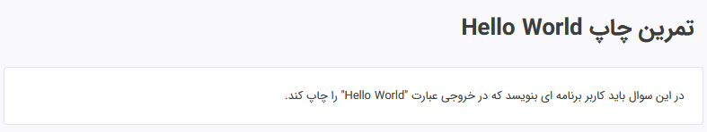  
[Link to Assignment 1 Python code](tamin1.py)

## Assignment 2 : Interrupted string practice
  
[Link to Assignment 2 Python code](tamin2.py)

## Assignment 3 : List manipulation practice
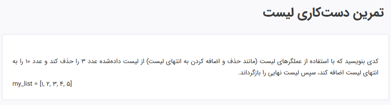  
[Link to Assignment 3 Python code](tamin3.py)

## Assignment 4 : Fruit vocabulary practice
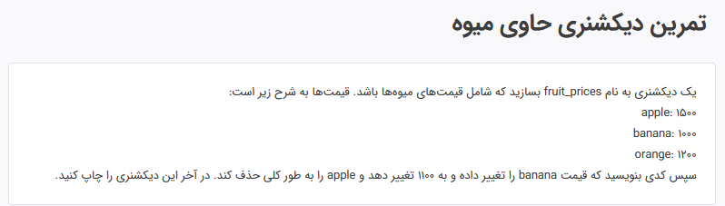  
[Link to Assignment 4 Python code](tamin4.py)

## Assignment 5 : distance between two points with tuples practice
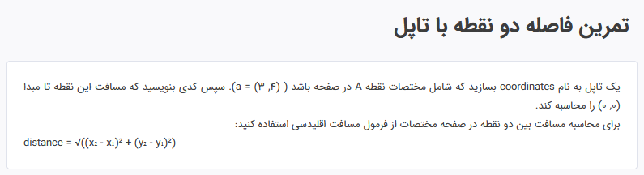  
[Link to Assignment 5 Python code](tamin5.py)

## Assignment 6 : Python City Wizard Practice
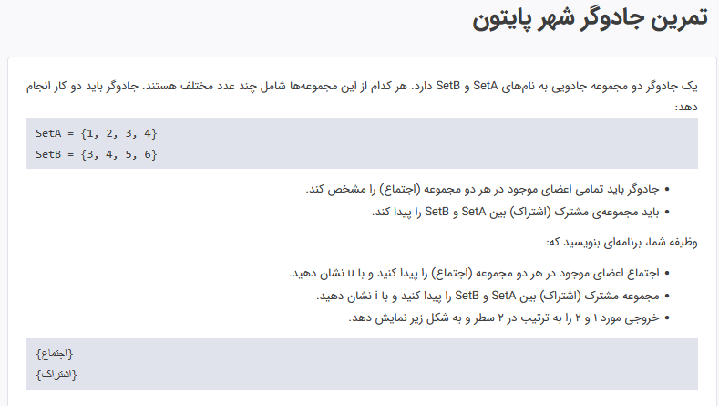  
[Link to Assignment 6 Python code](tamin6.py)

## Assignment 7 : Chaining operators practice
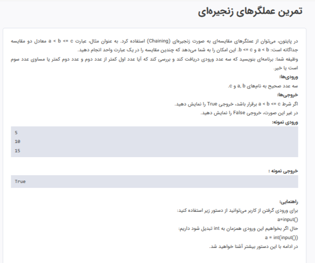  
[Link to Assignment 7 Python code](tamin7.py)

## Assignment 8 : Conditional store practice
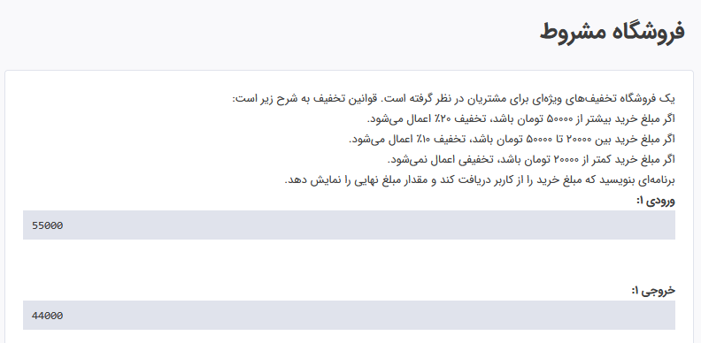  
[Link to Assignment 8 Python code](tamin8.py)

## Assignment 9 : The magic of the ring practice
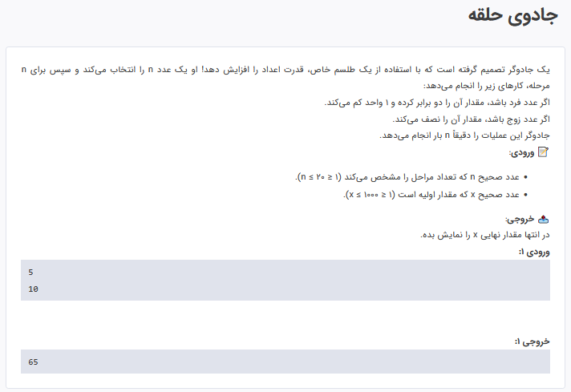  
[Link to Assignment 9 Python code](tamin9.py)

## Assignment 10 : Magic Machine Practice
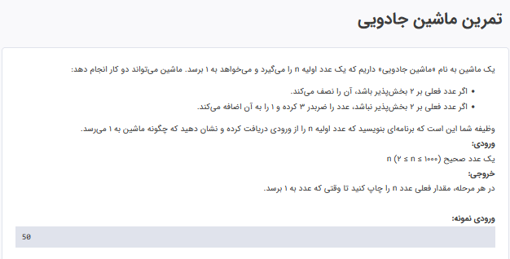
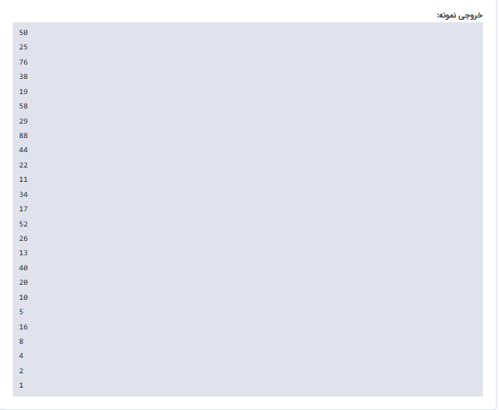  
[Link to Assignment 10 Python code](tamin10.py)

## Assignment 11 : Magic Number Spell Practice
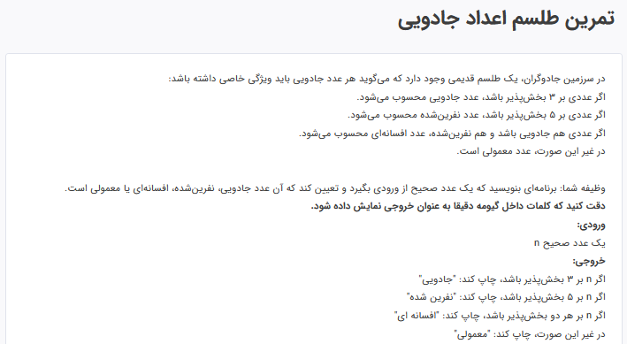
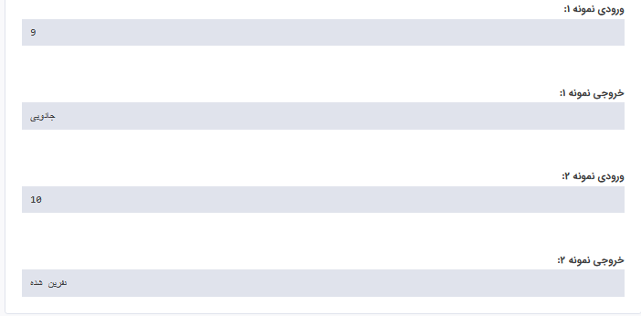  
[Link to Assignment 11 Python code](tamin11.py)

## Assignment 12 : Hello Function practice: Part 1
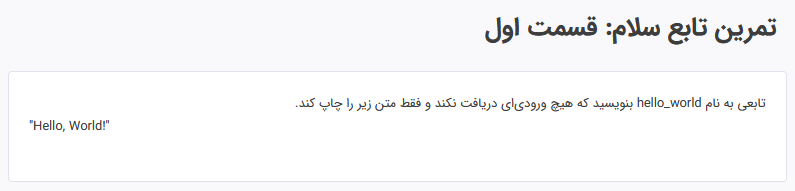 
[Link to Assignment 12 Python code](tamin12.py)

## Assignment 13 : Hello Function practice: Part 2
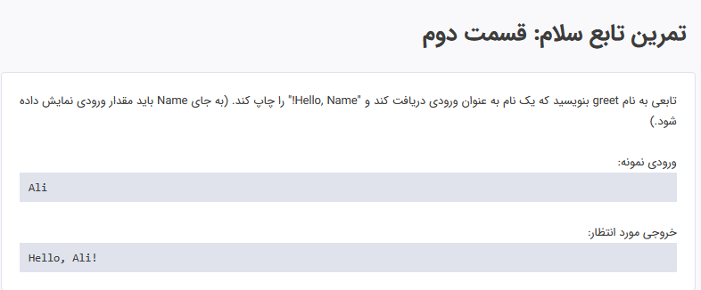
[Link to Assignment 13 Python code](tamin13.py)

## Assignment 14 : Positive or negative practice
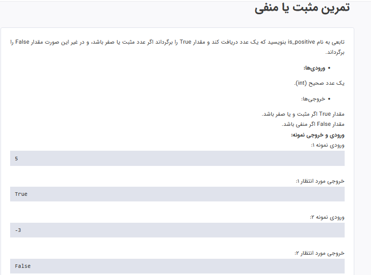

[Link to Assignment 14 Python code](tamin14.py)

## Assignment 15 : Sum of squares practice
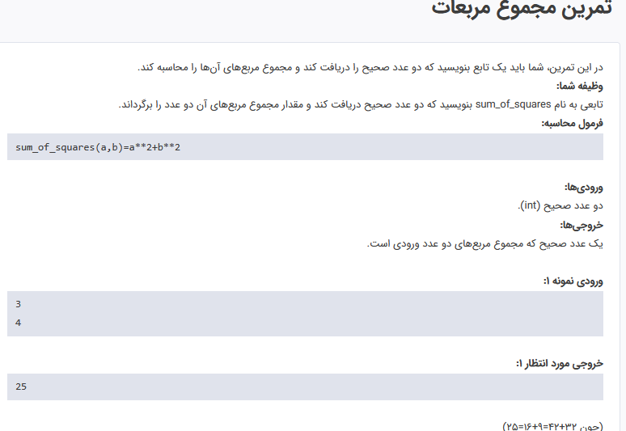
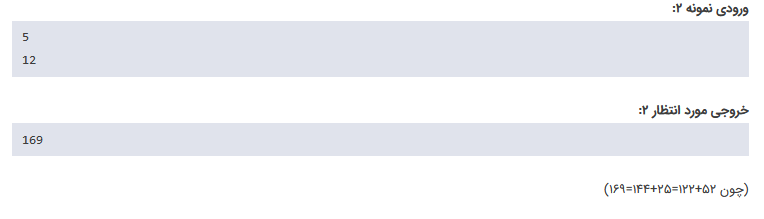  
[Link to Assignment 15 Python code](tamin15.py)

## Assignment 16 : Pair or individual practice
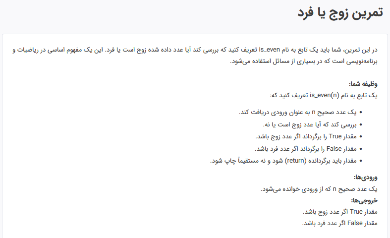
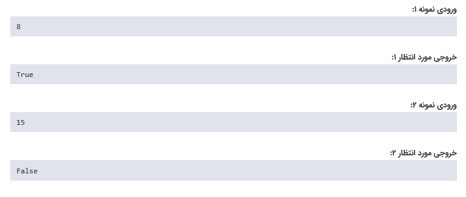  
[Link to Assignment 16 Python code](tamin16.py)

## Assignment 17 : Big or small practice

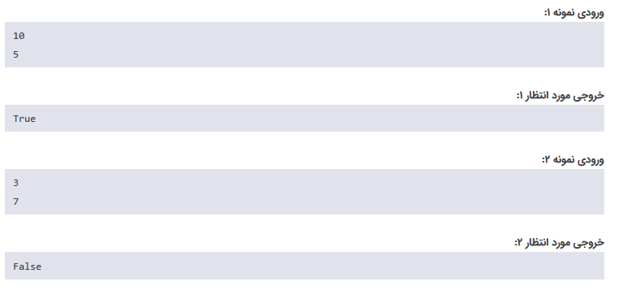  
[Link to Assignment 17 Python code](tamin17.py)

## Assignment 18 : Input from args practice
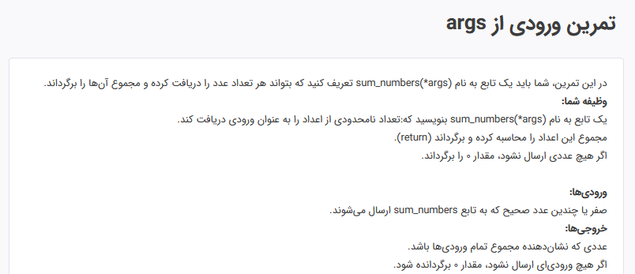
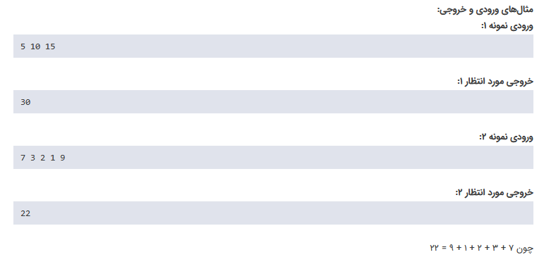  
[Link to Assignment 18 Python code](tamin18.py)

## Assignment 19 : Take the evens practice
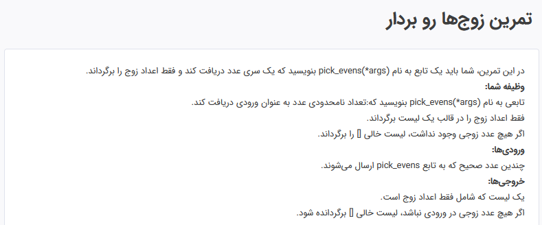
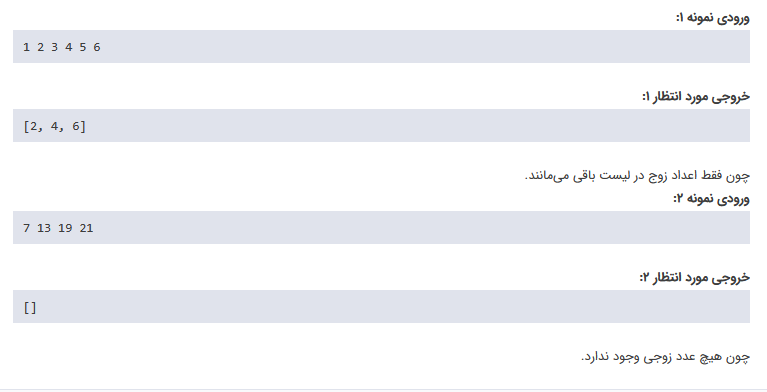  
[Link to Assignment 19 Python code](tamin19.py)

## Assignment 20 : The tallest building in Tehran practice

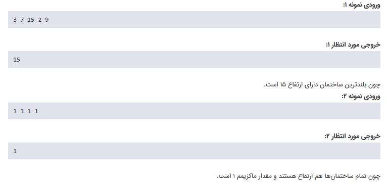  
[Link to Assignment 20 Python code](tamin20.py)

## Assignment 21 : Animal management system design in a zoo practice
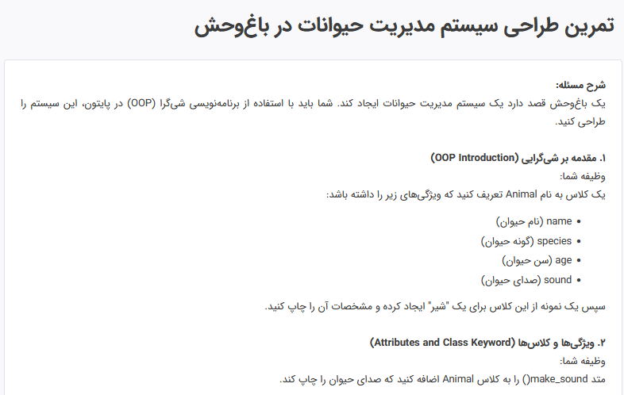
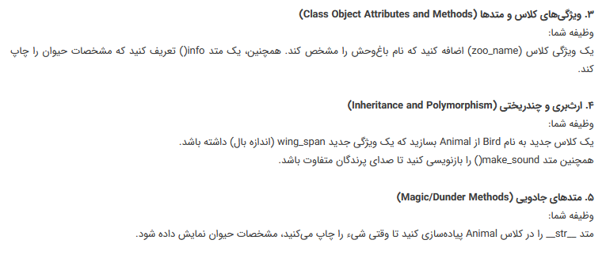  
[Link to Assignment 21 Python code](tamin21.py)

### another assignments is coming soon ...

&nbsp;

---

<h2 style="text-align: center; border-bottom: none; ">About me</h2>
<h3 style="text-align: center; border-bottom: none; ">Ahmadreza Haj Talebi, Aerospace Engineering student.</h3>